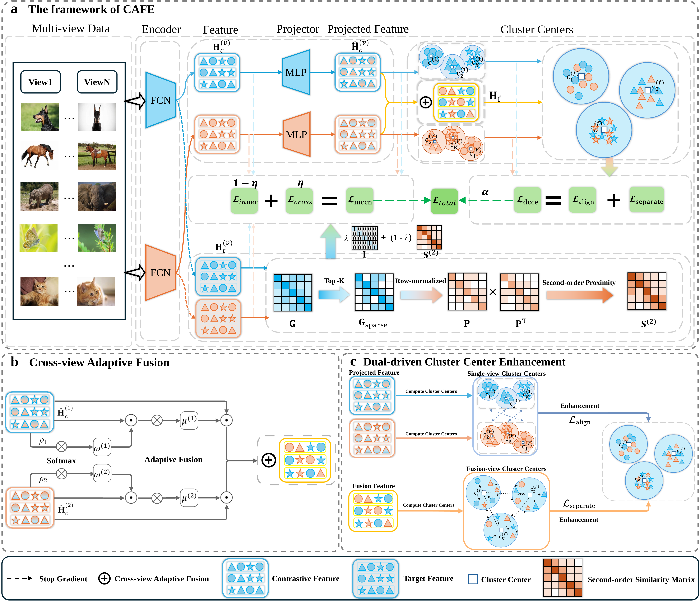

# CAFE

<div align="center">

**Core PyTorch implementation for CAFE: Cross-view Adaptive Fusion and Cluster Center Enhancement for Robust Multi-view Clustering**


</div>

This repository contains the core experimental code for **CAFE**, a deep multi-view clustering framework with cross-view adaptive fusion and dual-driven cluster-center enhancement. The implementation is centered on the `CAFE` model in `model.py`, and provides training, incomplete-view simulation, feature extraction, K-means evaluation, and logging utilities.

> Framework figure: [docs/assets/model_framework.pdf](docs/assets/model_framework.pdf)



## Repository Structure

```text
.
|-- config/
|   `-- Scene15.yaml              # Default experiment configuration
|-- data/
|   `-- Scene_15.mat              # Scene15 data used by the default config
|-- docs/
|   `-- assets/
|       |-- model_framework.pdf   # Original paper framework figure
|       `-- model_framework.png   # GitHub README preview
|-- models/
|   |-- alias.py                  # Alias sampling utilities
|   `-- line.py                   # LINE second-order proximity helper
|-- dataset_loader.py             # MATLAB data loading and incomplete-view masks
|-- main.py                       # Argument parsing, config merge, experiment loop
|-- model.py                      # CAFE model definition
|-- train.py                      # Training and evaluation routines
|-- utils.py                      # Metrics, logging, seed control, LR schedule
`-- environment.yml               # Full Conda environment
```

## Environment

The complete environment is recorded in `environment.yml`. The most important versions are:

| Component | Version |
| --- | --- |
| Python | 3.12.5 |
| PyTorch | 2.4.1 |
| CUDA runtime | 11.8 |
| NumPy | 1.26.4 |
| SciPy | 1.14.1 |
| scikit-learn | 1.5.1 |
| NetworkX | 3.2.1 |
| Matplotlib | 3.9.2 |
| PyYAML | 6.0.1 |
| Munkres | 1.1.4 |
| torch-geometric | 2.6.1 |

Create the environment with Conda:

```bash
conda env create -f environment.yml
conda activate CAFE
```

The code imports `torch_clustering.PyTorchKMeans` in `model.py`. This repository includes `torch_clustering/` as a local package. If you remove it or use a clean external environment, install the PyTorch implementation used by this code:

```bash
pip install git+https://github.com/Hzzone/torch_clustering.git
```

The current implementation assumes a CUDA-capable GPU. Several model paths call `.cuda()` directly, so CPU-only execution requires small code changes.

## Quick Start

Run the default Scene15 experiment:

```bash
python main.py --config_file config/Scene15.yaml
```

The default configuration uses:

```yaml
dataset: Scene15
n_views: 2
n_classes: 15
n_samples: 4485
batch_size: 1024
temperature: 0.9
blr: 5.0e-5
train_time: 5
accelerate: 'yes'
```


The final log reports the best result for each run and the averaged K-means metrics:

```text
Best Result: epoch ... by NMI | K-means: NMI = ... ARI = ... F = ... ACC = ...
Average K-means Result: ACC = mean(std) NMI = mean(std) ARI = mean(std)
```

## Incomplete-view Experiments

The incomplete-view mask is generated in `IncompleteMultiviewDataset._get_mask`. To simulate missing views, set `missing_rate` either from the command line or directly in the YAML file:

```bash
python main.py --config_file config/Scene15.yaml --missing_rate 0.3
```

If a parameter already appears in the YAML file, the YAML value takes precedence because `main.py` merges the config after parsing command-line arguments. For repeated experiments, editing the YAML file is the clearest option.

## Configuration Guide

Each dataset should have a matching YAML file under `config/`. The key fields are:

| Field | Meaning |
| --- | --- |
| `dataset` | Dataset name consumed by `dataset_loader.py` |
| `data_path` | Folder containing the `.mat` data file |
| `encoder_dim` | Per-view MLP dimensions, including input and output dimensions |
| `n_views` | Number of views |
| `n_classes` | Number of clusters/classes |
| `n_samples` | Number of samples used for tensors and evaluation buffers |
| `batch_size` | Batch size for training |
| `temperature` | Contrastive and cluster loss temperature |
| `alpha`, `beta` | Weights for the complementary cluster-center losses |
| `start_rectify_epoch` | Epoch to start pseudo-label based rectification |
| `blr` | Base learning rate used by `main.py` |
| `train_time` | Number of repeated runs; the seed is increased after each run |
| `accelerate` | Whether to load tensors directly onto GPU |

The provided implementation is prepared for two-view experiments. Some paths in `model.py`, such as cross-view reconstruction and contrastive pairing, explicitly use view `0` and view `1`.

## Using a New Dataset

1. Place the `.mat` file under `data/`, or update `data_path` in your config.
2. Add or adapt a loading branch in `dataset_loader.load_mat`.
3. Create a new YAML config with the correct `encoder_dim`, `n_views`, `n_samples`, and `n_classes`.
4. Run:

```bash
python main.py --config_file config/YourDataset.yaml
```

For a new two-view dataset, `encoder_dim` should follow this pattern:

```yaml
encoder_dim:
  - [view1_input_dim, 1024, 1024, 1024, 128]
  - [view2_input_dim, 1024, 1024, 1024, 128]
```

## Troubleshooting

| Symptom | Suggested fix |
| --- | --- |
| `Namespace` has no attribute `blr` | Always run with a YAML config; `blr` is defined in `config/Scene15.yaml`. |
| `ModuleNotFoundError: torch_clustering` | Install `torch_clustering` from `https://github.com/Hzzone/torch_clustering`. |
| CUDA is unavailable | Use a CUDA GPU, or replace the hard-coded `.cuda()` calls with device-aware `.to(device)` logic. |
| GPU memory is insufficient | Lower `batch_size` in the YAML file. |
| Dataset shape mismatch | Check `encoder_dim`, `n_samples`, and the `.mat` keys in `dataset_loader.py`. |

## Citation

If you find this code useful for your research, please consider citing our paper:

@article{lan2026cafe,
  title   = {CAFE: Cross-View Adaptive Fusion and Cluster Center Enhancement for Robust Multi-View Clustering},
  author  = {Lan, Wei and Guo, Yinghao and Chen, Qingfeng and Zhang, Shichao and Pan, Shirui and Zhou, Huiyu and Pan, Yi and Wen, Jie},
  journal = {IEEE Transactions on Pattern Analysis and Machine Intelligence},
  year    = {2026},
  pages   = {1--17},
  doi     = {10.1109/TPAMI.2026.3708284}
}
